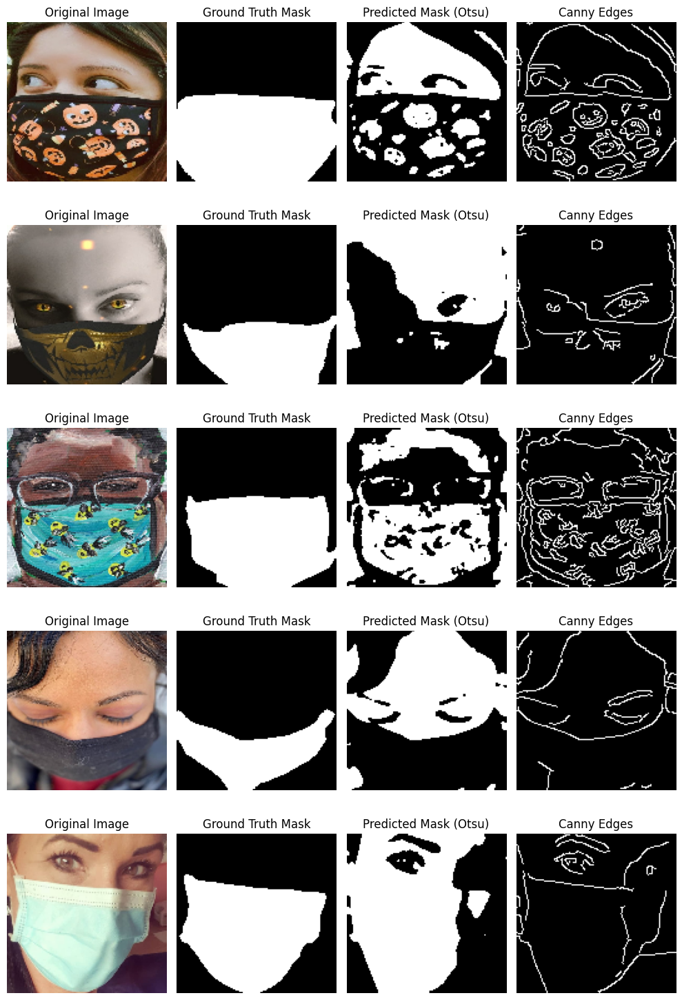
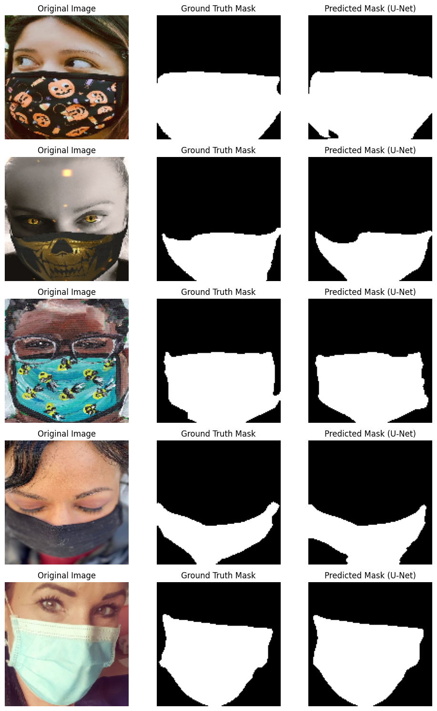

# **Deep Learning-Based Image Segmentation using U-Net**  

This project implements **image segmentation** using a **pretrained U-Net model** and compares it with **traditional segmentation techniques** such as **Otsu’s Thresholding** and **Canny Edge Detection**. The objective is to evaluate the effectiveness of deep learning-based segmentation methods against traditional approaches.  

---

## **1. Introduction**  

Image segmentation is a fundamental task in computer vision where an image is divided into meaningful regions. This project:  
- Implements **traditional segmentation techniques** (Otsu Thresholding & Canny Edge Detection).  
- Trains a **U-Net model** with different encoder backbones and loss functions.  
- Evaluates the segmentation quality using **IoU (Intersection over Union) and Dice Coefficient**.  

---

## **2. Dataset**  

- **Source**: A Masked Face Segmentation Dataset with ground truth face masks can be accessed here: [MFSD](https://github.com/sadjadrz/MFSD)  
- **Images Path**: `/dataset2/face_crop`  
- **Masks Path**: `/dataset2/face_crop_segmentation`  

### **Why This Dataset?**  
Mask region segmentation is a **preliminary stage** to tackle the **occlusion issue** in face-related tasks. Most existing masked face datasets do not provide **binary segmentation maps**, as manually segmenting mask regions is a **time-consuming operation**. Instead, many datasets create **synthetic masks** by overlaying them on existing face datasets, which often results in **unnatural appearances**.  

To **overcome this issue**, the **Masked Face Segmentation Dataset (MFSD)** is the first public dataset specifically designed for **face mask segmentation** tasks, offering real ground-truth segmentation maps.  

---

## **3. Methodology**  

### **3.1 Data Preprocessing**  
- **Images are loaded and normalized** (pixel values scaled to `[0,1]`).  
- **Masks are binarized** (converted to `[0,1]` values).  
- Dataset is split into **80% testing and 20% training**.  

### **3.2 Traditional Segmentation**  
Implemented two classical image segmentation techniques:  
1. **Otsu’s Thresholding**: Automatically determines the threshold to segment foreground from background.  
2. **Canny Edge Detection**: Detects edges based on gradient intensity.  

**Visualization of Traditional Segmentation:**  
<p align="center">
  
</p>  

### **3.3 Deep Learning-Based Segmentation**  
- Implemented **U-Net** with different encoder backbones (**ResNet-50, VGG**).  
- Experimented with different **loss functions**:  
  - **Binary Cross Entropy (BCE)**  
  - **Dice Loss**  
- Trained using **Adam optimizer**, batch sizes **8 & 16**, for **10 epochs**.  

**Visualization of U-Net Segmentation:**  
<p align="center">
  
</p>  

---

## **4. Hyperparameters and Experiments**  

| Model Variant               | Backbone  | Loss Function        | Batch Size | IoU Score | Dice Score |
|-----------------------------|-----------|----------------------|------------|-----------|------------|
| Pretrained U-Net           | VGG       | Dice Loss           | 8          | 0.8911    | 0.9363     |
| Pretrained U-Net           | VGG       | Binary Cross Entropy | 8          | 0.8936    | 0.9370     |
| Pretrained U-Net           | ResNet-50 | Dice Loss           | 8          | 0.9010    | 0.9429     |
| Pretrained U-Net           | ResNet-50 | Binary Cross Entropy | 8          | 0.9121    | 0.9493     |
| Pretrained U-Net           | ResNet-50 | Binary Cross Entropy | 16         | 0.8948    | 0.9389     |

---

## **5. Results**  

| Approach                         | IoU Score | Dice Score |
|-----------------------------------|-----------|------------|
| **Traditional Segmentation (Otsu + Canny)** | 0.2779    | 0.0015     |
| **Pretrained U-Net (ResNet-50 + BCE, batch=8)** | 0.9121    | 0.9493     |

### **Observations**  
1. **U-Net outperforms traditional methods** significantly.  
2. **ResNet-50 performs better than VGG** for segmentation.  
3. **Binary Cross Entropy (BCE) loss** performs better than Dice Loss.  
4. Increasing **batch size from 8 to 16 led to a slight drop in performance**.  

---

## **6. How to Run the Code**  

### **6.1 Install Dependencies**  

install required packages:  
```bash
pip install tensorflow segmentation_models numpy matplotlib opencv-python scikit-image scikit-learn
```  

### **6.2 Run the Segmentation Pipeline**  
```bash
python 3rd_4th_Mini_project.py
```  

