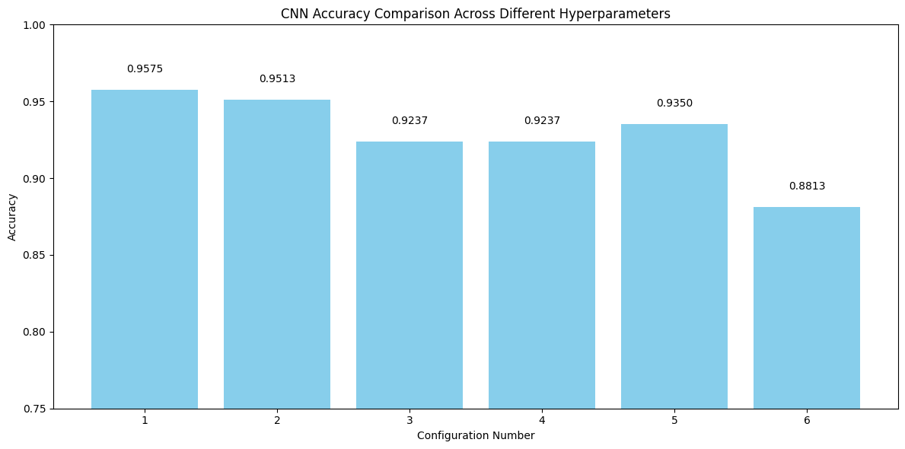
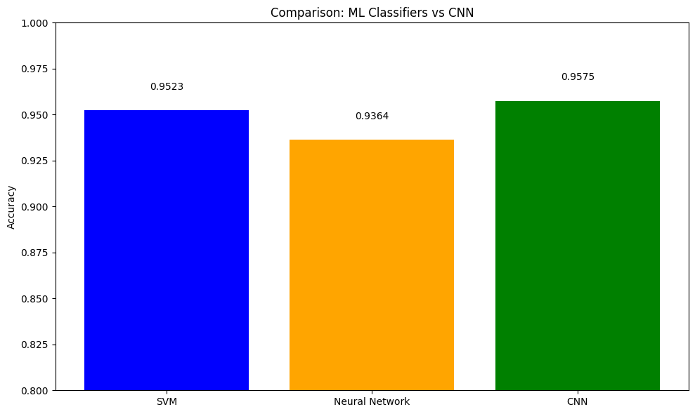

# Face Mask Detection Classifier

## **1. Introduction**
This paart of the project aims to develop a binary classification system to detect whether a person is wearing a face mask or not. Two approaches are compared:  
1. **Traditional Machine Learning (ML) Classifiers** with handcrafted features (HOG and color histograms).  
2. **Convolutional Neural Network (CNN)** with automated feature learning.  
The goal is to evaluate which method performs better for this task.

---

## **2. Dataset**
- **Source**: A labeled dataset containing images of people with and without face masks can be accessed here: [dataset](https://github.com/chandrikadeb7/Face-MaskDetection/tree/master/dataset).  
- **Structure**:  
  - Two classes: `with_mask` (labeled as 1) and `without_mask` (labeled as 0).  
  - Images are resized to `128x128` for CNN and `64x64` for ML models.  
  - Preprocessing: Normalization (pixel values scaled to `[0, 1]`) and grayscale conversion for feature extraction in ML models.

---

## **3. Methodology**
### Feature Extraction (ML Models)
1. **HOG Features**: Extracted using 9 orientations, 8x8 pixels/cell, and L2-Hys normalization.  
2. **Color Histograms**: Computed in HSV space with 32 bins per channel.  
3. **Combined Features**: HOG and color histograms concatenated into a single feature vector.  

### Model Training
- **ML Classifiers**:  
  - **SVM**: RBF kernel, `C=10`, `gamma='scale'`.  
  - **Neural Network**: MLP with `(100, 50)` hidden layers, ReLU activation, Adam optimizer.  
- **CNN Architecture**:  
  - Three convolutional blocks with Batch Normalization, MaxPooling, and Dropout.  
  - Fully connected layers with `256` neurons and `softmax` output.  
  - Data augmentation: Rotation, shifts, flips, and zoom.  

### Evaluation
- Metrics: Accuracy.  
- Train-test split: `80-20` ratio.  

---

## **4. Hyperparameters and Experiments (CNN)**
### Hyperparameter Variations
| Configuration | Learning Rate | Optimizer | Activation | Batch Size | Accuracy |
|---------------|---------------|-----------|------------|------------|----------|
| 1             | 0.001         | Adam      | ReLU       | 16         | 0.9575   |
| 2             | 0.001         | Adam      | ReLU       | 32         | 0.9513   |
| 3             | 0.1           | Adam      | ReLU       | 16         | 0.9237   |
| 4             | 0.1           | Adam      | ReLU       | 32         | 0.9237   |
| 5             | 0.005         | Adam      | ReLU       | 16         | 0.9350   |
| 6             | 0.005         | Adam      | ReLU       | 32         | 0.8813   |

**Best Configuration**: Config 1 (Accuracy: 95.75%).

---

## **5. Results**
### Model Comparison
| Method              | Accuracy |
|---------------------|----------|
| SVM                 | 95.23%   |
| Neural Network (MLP)| 93.64%   |
| **CNN (Best)**      | **95.75%** |

### Confusion Matrices
  
  

### Accuracy Comparison Charts
  
  

### CNN and ML Comparison Charts

---

## **6. Observations and Analysis**
- **CNN Superiority**: The CNN achieved the highest accuracy (95.75%), outperforming SVM and MLP. This is attributed to its ability to learn spatial hierarchies of features directly from images.  
- **Challenges**:  
  - ML models rely on manual feature engineering, which may miss subtle patterns.  
  - Class imbalance was addressed using stratified sampling.  
  - Overfitting in CNN was mitigated using dropout layers and data augmentation.  

---

Here is the complete "How to Run the Code" section formatted as a continuous markdown block:

## vii. How to Run the Code

### Dependencies
```bash
pip install tensorflow scikit-learn opencv-python matplotlib numpy
```

### Steps
1. **Dataset Setup**  
   Ensure the dataset is structured as:  
   ```
   /path/to/dataset/
     ├── with_mask/
     │   ├── image1.jpg
     │   ├── image2.jpg
     │   └── ...
     └── without_mask/
         ├── image1.jpg
         ├── image2.jpg
         └── ...
   ```

2. **Execution**  
   Run the 1st_2nd_Mini_project.ipynb in colab/jupyter lab.

3. **Outputs**  
   - Trained CNN model: `best_cnn_model.h5`  
   - Accuracy plots:  
     - `ml_accuracy_comparison.png`  
     - `cnn_accuracy_comparison.png`  
   - Confusion matrices:  
     - `ml_confusion_matrices.png`  
     - `cnn_confusion_matrix.png`  
   - Training history plot: `cnn_training_history.png`

---

**Note**: Replace `/path/to/dataset/` with your actual dataset path. Generated plots will be saved automatically in your working directory.


# Face Mask Segmentation

This project implements **image segmentation** using a **pretrained U-Net model** and compares it with **traditional segmentation techniques** such as **Otsu’s Thresholding** and **Canny Edge Detection**. The objective is to evaluate the effectiveness of deep learning-based segmentation methods against traditional approaches.  

---

## **1. Introduction**  

Image segmentation is a fundamental task in computer vision where an image is divided into meaningful regions. This project:  
- Implements **traditional segmentation techniques** (Otsu Thresholding & Canny Edge Detection).  
- Trains a **U-Net model** with different encoder backbones and loss functions.  
- Evaluates the segmentation quality using **IoU (Intersection over Union) and Dice Coefficient**.  

---

## **2. Dataset**  

- **Source**: A Masked Face Segmentation Dataset with ground truth face masks can be accessed here: [MFSD](https://github.com/sadjadrz/MFSD)  
- **Images Path**: `/dataset2/face_crop`  
- **Masks Path**: `/dataset2/face_crop_segmentation`  

### **Why This Dataset?**  
Mask region segmentation is a **preliminary stage** to tackle the **occlusion issue** in face-related tasks. Most existing masked face datasets do not provide **binary segmentation maps**, as manually segmenting mask regions is a **time-consuming operation**. Instead, many datasets create **synthetic masks** by overlaying them on existing face datasets, which often results in **unnatural appearances**.  

To **overcome this issue**, the **Masked Face Segmentation Dataset (MFSD)** is the first public dataset specifically designed for **face mask segmentation** tasks, offering real ground-truth segmentation maps.  

---

## **3. Methodology**  

### **3.1 Data Preprocessing**  
- **Images are loaded and normalized** (pixel values scaled to `[0,1]`).  
- **Masks are binarized** (converted to `[0,1]` values).  
- Dataset is split into **80% testing and 20% training**.  

### **3.2 Traditional Segmentation**  
Implemented two classical image segmentation techniques:  
1. **Otsu’s Thresholding**: Automatically determines the threshold to segment foreground from background.  
2. **Canny Edge Detection**: Detects edges based on gradient intensity.  

**Visualization of Traditional Segmentation:**  
<p align="center">
  
</p>  

### **3.3 Deep Learning-Based Segmentation**  
- Implemented **U-Net** with different encoder backbones (**ResNet-50, VGG**).  
- Experimented with different **loss functions**:  
  - **Binary Cross Entropy (BCE)**  
  - **Dice Loss**  
- Trained using **Adam optimizer**, batch sizes **8 & 16**, for **10 epochs**.  

**Visualization of U-Net Segmentation:**  
<p align="center">
  
</p>  

---

## **4. Hyperparameters and Experiments**  

| Model Variant               | Backbone  | Loss Function        | Batch Size | IoU Score | Dice Score |
|-----------------------------|-----------|----------------------|------------|-----------|------------|
| Pretrained U-Net           | VGG       | Dice Loss           | 8          | 0.8911    | 0.9363     |
| Pretrained U-Net           | VGG       | Binary Cross Entropy | 8          | 0.8936    | 0.9370     |
| Pretrained U-Net           | ResNet-50 | Dice Loss           | 8          | 0.9010    | 0.9429     |
| Pretrained U-Net           | ResNet-50 | Binary Cross Entropy | 8          | 0.9121    | 0.9493     |
| Pretrained U-Net           | ResNet-50 | Binary Cross Entropy | 16         | 0.8948    | 0.9389     |

---

## **5. Results**  

| Approach                         | IoU Score | Dice Score |
|-----------------------------------|-----------|------------|
| **Traditional Segmentation (Otsu + Canny)** | 0.2779    | 0.0015     |
| **Pretrained U-Net (ResNet-50 + BCE, batch=8)** | 0.9121    | 0.9493     |

### **Observations**  
1. **U-Net outperforms traditional methods** significantly.  
2. **ResNet-50 performs better than VGG** for segmentation.  
3. **Binary Cross Entropy (BCE) loss** performs better than Dice Loss.  
4. Increasing **batch size from 8 to 16 led to a slight drop in performance**.  

---

## **6. How to Run the Code**  

### **6.1 Install Dependencies**  

install required packages:  
```bash
pip install tensorflow segmentation_models numpy matplotlib opencv-python scikit-image scikit-learn
```  

### **6.2 Run the Segmentation Pipeline**  
Run the 3rd_4th_Mini_project.ipynb in colab/jupyter lab

